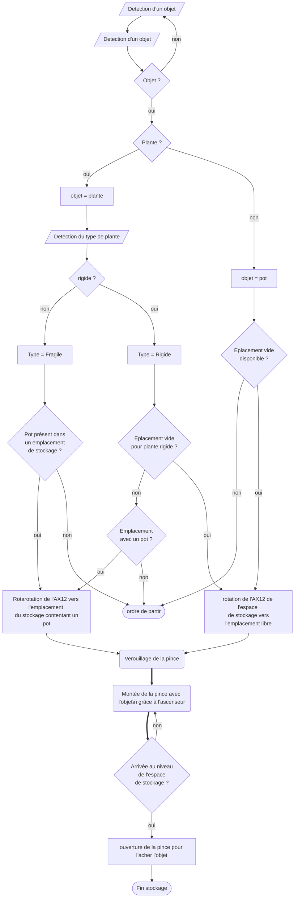

# Architrecture de l'asservissement Mermaid:

```mermaid
flowchart TD;
  Debut[/"`Ramassage des objets`"\] -->Detect[/"`Detection d'un objet`"/]-->Objet{Objet ?};
  Objet-->|non| Debut[/"`Detection d'un objet`"/];
  Objet-->|oui| Plante{Plante ?};

  Plante -->|oui| ObjetPlante["objet = plante"]-->rigide[/"`Detection du type de plante`"/];
  Plante -->|non| ObjetPot["objet = pot"];

  rigide-->Rigide{rigide ?};
  Rigide-->|non|TypeFragile["Type = Fragile"];
  Rigide-->|oui|typerigide["Type = Rigide"];

  TypeFragile-->Potpresent{Pot présent dans\n un emplacement \nde stockage ?};
  Potpresent--->|oui|AX12pot;
  Potpresent--->|non|Partir;

  typerigide-->Vide2{"Eplacement vide\n pour plante rigide ?"};
  Vide2-->|non| EmplacementPot{"Emplacement\n avec un pot ?"};
  Vide2-->|oui| AX12vide["rotation de l'AX12 de l'espace \n de stockage vers l'emplacement libre"] ;
  EmplacementPot-->|oui| AX12pot["Rotarotation de l'AX12 vers l'emplacement \n du stockage contentant un pot "];
  EmplacementPot-->|non| Partir;
  ObjetPot-->ObjetPot?{Eplacement vide\n disponible ?};
  ObjetPot?-->|non| Partir(["`ordre de partir`"]);
  ObjetPot?---->|oui| AX12vide;
  AX12vide-->VerouillagePince;
  AX12pot-->
  VerouillagePince("`Verouillage de la pince`")==>
  MontéPince("`Montée de la pince avec l'objet\n grâce à l'ascenseur `")==>
  Arrivee{"Arrivée au niveau \n de l'espace \nde stockage ?"};
  Arrivee-->|non| MontéPince;
  Arrivee-->|oui| Ouverture["ouverture de la pince pour l'acher l'objet"]-->
  Fin(["`Fin stockage`"]);
```
